## Test Run – Performance Metrics

## Definitions

The following definitions are listed to clarify important terms used throughout this document.  
These terms are aligned with the **EUDI Architecture and Reference Framework [R01]**.

| **Acronym** | **Definition** |
|--------------|----------------|
| **EUDI Wallet User** | Citizen/Natural person using the EUDI Wallet to receive, store and present attestations (PID, QEAA or EAA) about themselves, including to prove their identity. |
| **Issuer** | A Person Identification Data Provider issuing PID or a (Qualified) Trust Service Provider issuing (Q)EAA. In the case of the EUDI Wallet, there may be multiple Issuers for PID and (Q)EAA. |
| **mDL Provider** | mDL Providers maintain an interface for requesting and providing mDL to EUDI Wallets. |
| **PID** | A set of data enabling the identity of a natural person, or a natural person representing a legal person — eIDAS Regulation. |
| **PID Provider** | A Member State or legal entity providing Person Identification Data to Users. |
| **Relying Party** | Private or Public party providing online services, intending to utilize the EUDI Wallet for user identification and authentication purposes. |

## Performance Test Execution Summary

Performance tests are conducted on real devices hosted in the BrowserStack device farm.
The objective is to verify consistent performance and stability across multiple operating system versions and device types.

- BrowserStack Execution Devices

All applicable performance scenarios are executed on the following devices:

| **Platform** | **Device**            | **OS Version**        | **Purpose** |
|--------------|-----------------------|-----------------------|-------------|
| iOS          | iPhone 16             | iOS 18                | Response Time ≤ 2s, CPU ≤ 40%, Memory ≤ 250 MB, App Stability |
| iOS          | iPhone 15             | iOS 17                | Response Time ≤ 2s, CPU ≤ 40%, Memory ≤ 250 MB, App Stability |
| iOS          | iPhone 14             | iOS 26                | Response Time ≤ 2s, CPU ≤ 40%, Memory ≤ 250 MB, App Stability |
| Android      | Huawei Nova 13        | HarmonyOs 4/ OS 12    | Response Time ≤ 2s, CPU ≤ 40%, Memory ≤ 250 MB, App Stability |
| Android      | Samsung Galaxy A16 5G | Android 15            | Response Time ≤ 2s, CPU ≤ 40%, Memory ≤ 250 MB, App Stability |
| Android      | Google Pixel 8        | Android 14            | Response Time ≤ 2s, CPU ≤ 40%, Memory ≤ 250 MB, App Stability |
| Android      | OnePlus 11R           | Android 13 (OxygenOS) | Response Time ≤ 2s, CPU ≤ 40%, Memory ≤ 250 MB, App Stability |
| Android      | Redmi Note 12 Pro     | Android 12 (MIUI)     | Response Time ≤ 2s, CPU ≤ 40%, Memory ≤ 250 MB, App Stability |

- Scenarios Excluded from BrowserStack Execution

The following scenarios could not be executed on BrowserStack, as they require interaction between two distinct physical devices and cross-device communication that is not supported by the BrowserStack execution model:

1. Present Attestation from EUDI Wallet
2. Presentation of Batch Issued Attestations to Relying Party on Separate Device
3. Batch Issuance of Attestations in EUDI Wallet from Issuer Cross Device

- Local Device Execution for Cross-Device Scenarios

The above scenarios were executed locally using Android Studio and Xcode on physical devices, as shown below:

| **Platform** | **Device** | **OS Version** | **Purpose** |
|---------------|-------------|----------------|-------------|
| Android | POCO X5 Pro 5G | Android 14 | Response Time ≤ 2s, CPU ≤ 40%, Memory ≤ 250 MB, App Stability |
| iOS | iPhone 14 Plus | iOS 18 | Response Time ≤ 2s, CPU ≤ 40%, Memory ≤ 250 MB, App Stability

- Execution Environment Summary

The use of the BrowserStack device farm enables consistent and repeatable execution on real hardware, while significantly increasing platform, OS version, and vendor diversity compared to physical device-only testing.
Local execution was selectively applied only where cross-device interaction requirements could not be met in the cloud environment.

### Execution Process

Before each test:

Browserstack Farm:
- A connection was established to the required real device hosted in the BrowserStack device farm.
- The application under test was installed and launched on the selected device.
- BrowserStack App Live performance monitoring tools were enabled and configured to collect runtime metrics.

Local Execution:
- Both devices were connected to the laptop via USB.
- Android Studio Profiler (for Android) and Xcode Instruments (for iOS) were launched and configured for live performance tracking.
- The application was launched on each device.

During test execution:

Browserstack Farm:
- Each performance scenario was executed manually on the BrowserStack real device.
- CPU usage, memory usage, response time, and app stability were monitored using BrowserStack’s built-in performance profiling tools.
- Screenshots of performance metrics were captured during execution for documentation and analysis.

Local Execution:
- Each scenario was performed manually on the devices.
- CPU usage, memory usage, response time, and app stability were monitored in real time.
- Screenshots of performance metrics were captured during execution for documentation and analysis.

Detailed results and screenshot-based reports for each test execution are available below.

## Test Environment

The following specifications describe the environment in which performance testing was conducted.

### Android Environment
- **Device Used:** 
    1. POCO X5 Pro 5G
       - **Connection:** Connected to PC with IDE
       - **Tools Used:** Android Studio Profiler and App Inspection
       - **Network:** Wi-Fi
    2. Samsung Galaxy A16 5G - Android 15
       - **Connection:** Connected to Browserstack App Live Dashboard
       - **Tools Used:** BrowserStack’s built-in performance profiling tools.
       - **Network:** Wi-Fi
    3. Google Pixel - Android 14
       - **Connection:** Connected to Browserstack App Live Dashboard
       - **Tools Used:** BrowserStack’s built-in performance profiling tools.
       - **Network:** Wi-Fi
    4. OnePlus 11R - Android 13 (OxygenOS)
       - **Connection:** Connected to Browserstack App Live Dashboard
       - **Tools Used:** BrowserStack’s built-in performance profiling tools.
       - **Network:** Wi-Fi
    5. Redmi Note 12 Pro - Android 12 (MIUI)
       - **Connection:** Connected to Browserstack App Live Dashboard
       - **Tools Used:** BrowserStack’s built-in performance profiling tools.
       - **Network:** Wi-Fi
    6. Huawei Nova 13 - HarmonyOS 4 / OS 12
       - **Connection:** Connected to Browserstack App Live Dashboard
       - **Tools Used:** BrowserStack’s built-in performance profiling tools.
       - **Network:** Wi-Fi
      
- **Test Data:**
    - Simulated EUDI Wallet application with 10 documents
    - Dev Issuer: [https://ec.dev.issuer.eudiw.dev/](https://ec.dev.issuer.eudiw.dev/)
    - Dev Verifier: [https://dev.verifier.eudiw.dev/homee](https://dev.verifier.eudiw.dev/home)

### iOS Environment
- **Device Used:** 
    1. iPhone 14 Plus - iOS 18
       - **Connection:** Connected to PC with IDE
       - **Tools Used:** Xcode Instruments
       - **Network:** Wi-Fi
    2. iPhone 16 - iOS 18
       - **Connection:** Connected to Browserstack App Live Dashboard
       - **Tools Used:** BrowserStack’s built-in performance profiling tools.
       - **Network:** Wi-Fi
    3. iPhone 15 - iOS 17
       - **Connection:** Connected to Browserstack App Live Dashboard
       - **Tools Used:** BrowserStack’s built-in performance profiling tools.
       - **Network:** Wi-Fi
    4. iPhone 14 - iOS 26
       - **Connection:** Connected to Browserstack App Live Dashboard
       - **Tools Used:** BrowserStack’s built-in performance profiling tools.
       - **Network:** Wi-Fi

- **Test Data:**
    - Simulated EUDI Wallet application with 10 documents
    - Dev Issuer: [https://ec.dev.issuer.eudiw.dev/](https://ec.dev.issuer.eudiw.dev/)
    - Dev Verifier: [https://dev.verifier.eudiw.dev/homee](https://dev.verifier.eudiw.dev/home)

## Test Execution and Results

### Scenario 1: Add a Document from List

#### Device: Samsung Galaxy A16 5G - Android 15
**Figures:**
- Figure 1: CPU/Memory Graph
  

- Figure 2: Network Performance Graph

**Results:**
| Metric | Value |
|--------|--------|
| CPU Usage | 4.03% |
| Memory Usage | 237.18 MB |
| Response Time | < 1 s |

---

#### Device: Redmi Note 12 Pro - Android 12 (MIUI)
**Figures:**
- Figure 3: CPU/Memory Graph

- Figure 4: Network Performance Graph

**Results:**
| Metric | Value |
|--------|--------|
| CPU Usage | 6.28% |
| Memory Usage | 228.68 MB |
| Response Time | < 1 s |

---

#### Device: OnePlus 11R - Android 13 (OxygenOS)
**Figures:**
- Figure 5: CPU/Memory Graph

- Figure 6: Network Performance Graph

**Results:**
| Metric | Value |
|--------|--------|
| CPU Usage | 3.77% |
| Memory Usage | 218.79 MB |
| Response Time | < 1 s |

---

#### Device: Huawei Nova 13 - HarmonyOS 4 OS 12
**Figures:**
- Figure 7: CPU/Memory Graph

- Figure 8: Network Performance Graph

**Results:**
| Metric | Value |
|--------|--------|
| CPU Usage | CPU usage is unavailable for Huawei devices on BrowserStack. |
| Memory Usage | 237.99 MB |
| Response Time | < 1 s |

---

#### Device: Google Pixel 8 - Android 14
**Figures:**
- Figure 9: CPU/Memory Graph

- Figure 10: Network Performance Graph

**Results:**
| Metric | Value |
|--------|--------|
| CPU Usage | 3.27% |
| Memory Usage | 238.13 MB |
| Response Time | < 1 s |

---

#### Device: iPhone 14 - iOS 26
**Figures:**
- Figure 11: CPU/Memory Graph

- Figure 12: Network Performance Graph

**Results:**
| Metric | Value |
|--------|--------|
| CPU Usage | 5.06% |
| Memory Usage | 55.81 MB |
| Response Time | < 1 s |

---

#### Device: iPhone 15 - iOS 17
**Figures:**
- Figure 13: CPU/Memory Graph

- Figure 14: Network Performance Graph

**Results:**
| Metric | Value |
|--------|--------|
| CPU Usage | 1.88% |
| Memory Usage | 46.74 MB |
| Response Time | < 1 s |

---

#### Device: iPhone 16 - iOS 18
**Figures:**
- Figure 15: CPU/Memory Graph

- Figure 16: Network Performance Graph

**Results:**
| Metric | Value |
|--------|--------|
| CPU Usage | 1.56% |
| Memory Usage | 44.33 MB |
| Response Time | < 1 s |

---

### Scenario 2: Deferred Issuing

#### Device: Samsung Galaxy A16 5G - Android 15
**Figures:**
- Figure 17: CPU/Memory Graph

- Figure 18: Network Performance Graph

**Results:**
| Metric | Value |
|--------|--------|
| CPU Usage | 4.41% |
| Memory Usage | 237.12 MB |
| Response Time | < 1 s |

---

#### Device: Redmi Note 12 Pro - Android 12 (MIUI)
**Figures:**
- Figure 19: CPU/Memory Graph

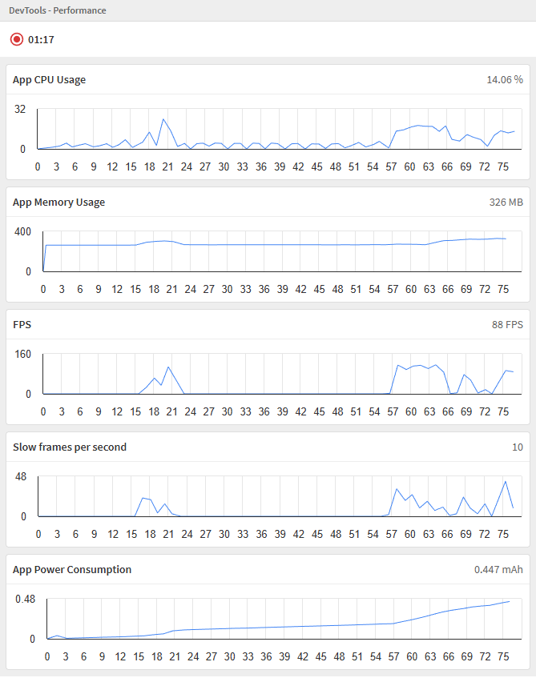

- Figure 20: Network Performance Graph

**Results:**
| Metric | Value |
|--------|--------|
| CPU Usage | 5.95% |
| Memory Usage | 280.32 MB |
| Response Time | < 1 s |

---

#### Device: OnePlus 11R - Android 13 (OxygenOS)
**Figures:**
- Figure 21: CPU/Memory Graph

- Figure 22: Network Performance Graph

**Results:**
| Metric | Value |
|--------|--------|
| CPU Usage | 3.57% |
| Memory Usage | 219.27 MB |
| Response Time | < 1 s |

---

#### Device: Huawei Nova 13 - HarmonyOS 4 OS 12
**Figures:**
- Figure 23: CPU/Memory Graph

- Figure 24: Network Performance Graph

**Results:**
| Metric | Value |
|--------|--------|
| CPU Usage | 3.64% |
| Memory Usage | 242.02 MB |
| Response Time | < 1 s |

---

#### Device: Google Pixel 8 - Android 14
**Figures:**
- Figure 25: CPU/Memory Graph

- Figure 26: Network Performance Graph

**Results:**
| Metric | Value |
|--------|--------|
| CPU Usage | 3.03% |
| Memory Usage | 239.31 MB |
| Response Time | < 1 s |

---

#### Device: iPhone 14 - iOS 26
**Figures:**
- Figure 27: CPU/Memory Graph

- Figure 28: Network Performance Graph

**Results:**
| Metric | Value |
|--------|--------|
| CPU Usage | 1.08% |
| Memory Usage | 83.65 MB |
| Response Time | < 1 s |

---

#### Device: iPhone 15 - iOS 17
**Figures:**
- Figure 29: CPU/Memory Graph

- Figure 30: Network Performance Graph

**Results:**
| Metric | Value |
|--------|--------|
| CPU Usage | 0.86% |
| Memory Usage | 49.09 MB |
| Response Time | < 1 s |

---

#### Device: iPhone 16 - iOS 18
**Figures:**
- Figure 31: CPU/Memory Graph

- Figure 32: Network Performance Graph

**Results:**
| Metric | Value |
|--------|--------|
| CPU Usage | 0.73% |
| Memory Usage | 46.55 MB |
| Response Time | < 1 s |

---

### Scenario 3: Credential Issuance (Same Device)

#### Device: Samsung Galaxy A16 5G - Android 15
**Figures:**
- Figure 33: CPU/Memory Graph

- Figure 34: Network Performance Graph

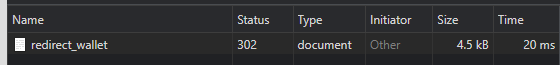

**Results:**
| Metric | Value |
|--------|--------|
| CPU Usage | 4.15% |
| Memory Usage | 227.72 MB |
| Response Time | < 1 s |

---

#### Device: Redmi Note 12 Pro - Android 12 (MIUI)
**Figures:**
- Figure 35: CPU/Memory Graph

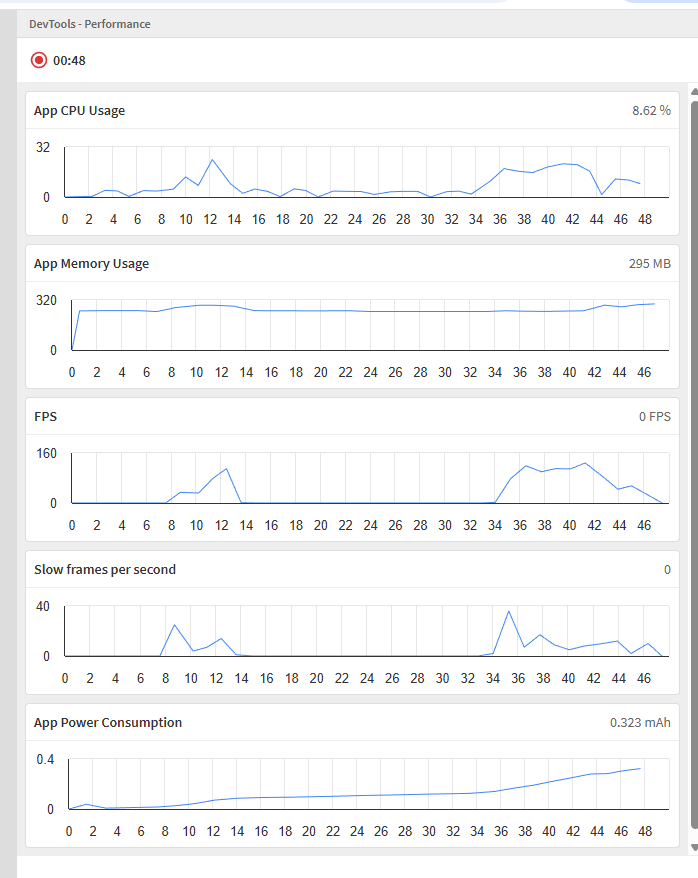

- Figure 36: Network Performance Graph

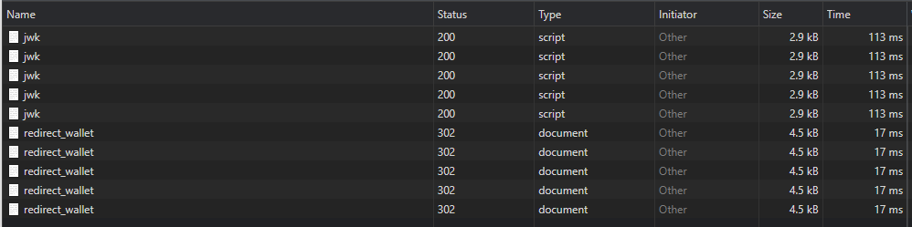

**Results:**
| Metric | Value |
|--------|--------|
| CPU Usage | 6.71% |
| Memory Usage | 262.56 MB |
| Response Time | < 1 s |

---

#### Device: OnePlus 11R - Android 13 (OxygenOS)
**Figures:**
- Figure 37: CPU/Memory Graph

- Figure 38: Network Performance Graph

**Results:**
| Metric | Value |
|--------|--------|
| CPU Usage | 2.95% |
| Memory Usage | 220.38 MB |
| Response Time | < 1 s |

---

#### Device: Huawei Nova 13 - HarmonyOS 4 OS 12
**Figures:**
- Figure 39: CPU/Memory Graph

- Figure 40: Network Performance Graph

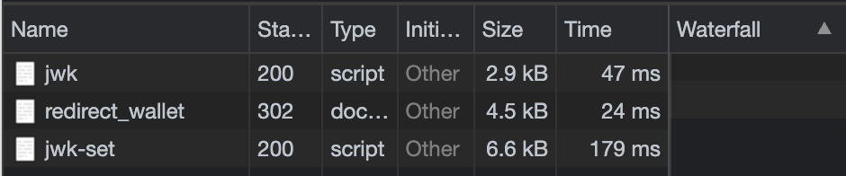

**Results:**
| Metric | Value |
|--------|--------|
| CPU Usage | CPU usage is unavailable for Huawei devices on BrowserStack. |
| Memory Usage | 243.31 MB |
| Response Time | < 1 s |

---

#### Device: Google Pixel 8 - Android 14
**Figures:**
- Figure 41: CPU/Memory Graph

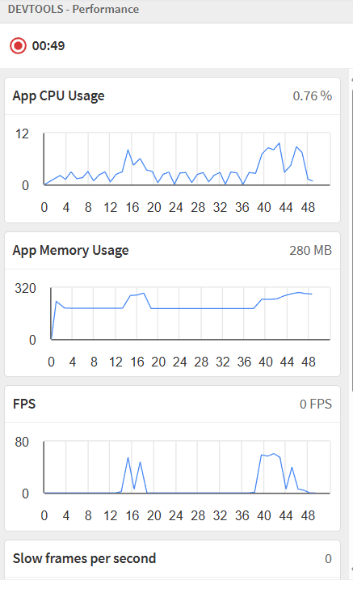

- Figure 42: Network Performance Graph

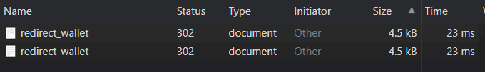

**Results:**
| Metric | Value |
|--------|--------|
| CPU Usage | 2.56% |
| Memory Usage | 235.9 MB |
| Response Time | < 1 s |

---

#### Device: iPhone 14 - iOS 26
**Figures:**
- Figure 43: CPU/Memory Graph

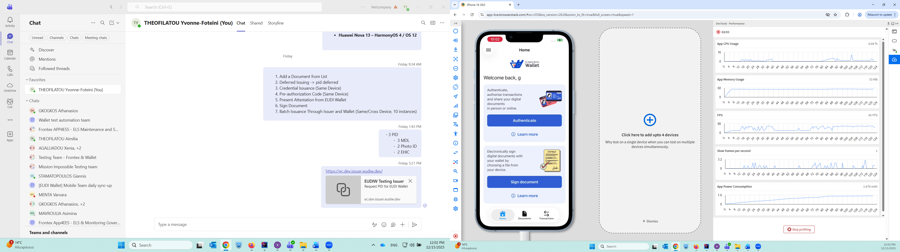

- Figure 44: Network Performance Graph

**Results:**
| Metric | Value |
|--------|--------|
| CPU Usage | 1.54% |
| Memory Usage | 52.06 MB |
| Response Time | < 1 s |

---

#### Device: iPhone 15 - iOS 17
**Figures:**
- Figure 45: CPU/Memory Graph

- Figure 46: Network Performance Graph

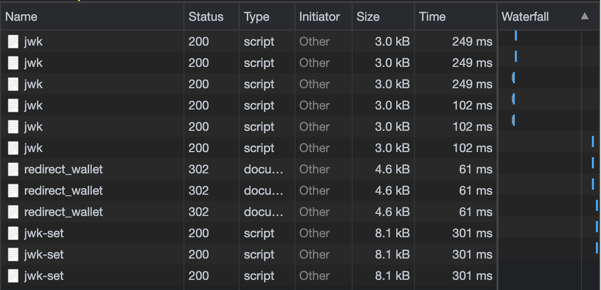

**Results:**
| Metric | Value |
|--------|--------|
| CPU Usage | 0.84% |
| Memory Usage | 49.62 MB |
| Response Time | < 1 s |

---

#### Device: iPhone 16 - iOS 18
**Figures:**
- Figure 47: CPU/Memory Graph

- Figure 48: Network Performance Graph

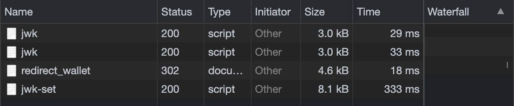

**Results:**
| Metric | Value |
|--------|--------|
| CPU Usage | 0.93% |
| Memory Usage | 47.28 MB |
| Response Time | < 1 s |

---

### Scenario 4: Batch Issuance Through Issuer (Same Device)

#### Device: Samsung Galaxy A16 5G - Android 15
**Figures:**
- Figure 49: CPU/Memory Graph

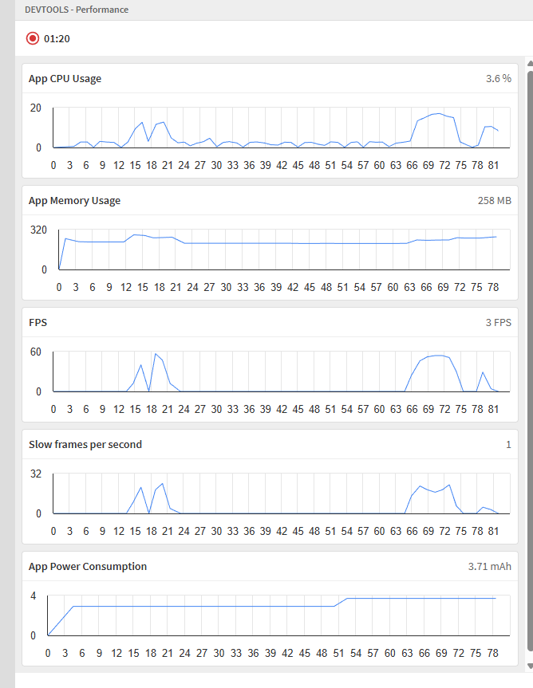

- Figure 50: Network Performance Graph

**Results:**
| Metric | Value |
|--------|--------|
| CPU Usage | 4.15% |
| Memory Usage | 227.72 MB |
| Response Time | < 1 s |

---

#### Device: Redmi Note 12 Pro - Android 12 (MIUI)
**Figures:**
- Figure 51: CPU/Memory Graph

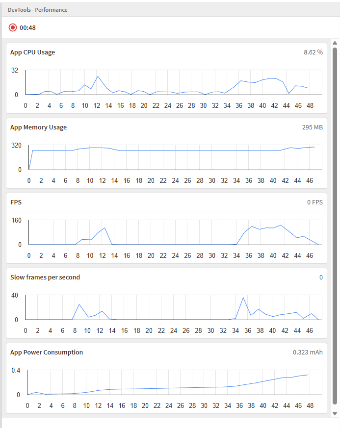

- Figure 52: Network Performance Graph

**Results:**
| Metric | Value |
|--------|--------|
| CPU Usage | 6.71% |
| Memory Usage | 262.56 MB |
| Response Time | < 1 s |

---

#### Device: OnePlus 11R - Android 13 (OxygenOS)
**Figures:**
- Figure 53: CPU/Memory Graph

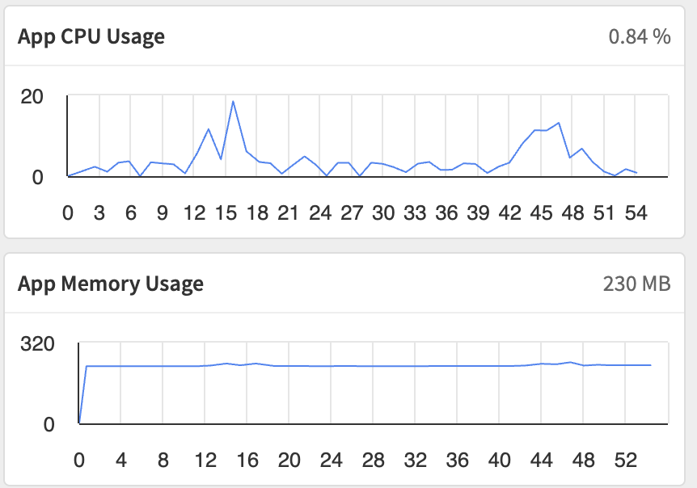

- Figure 54: Network Performance Graph

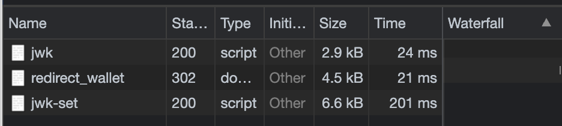

**Results:**
| Metric | Value |
|--------|--------|
| CPU Usage | 3.64% |
| Memory Usage | 228.62 MB |
| Response Time | < 1 s |

---

#### Device: Huawei Nova 13 - HarmonyOS 4 OS 12
**Figures:**
- Figure 55: CPU/Memory Graph

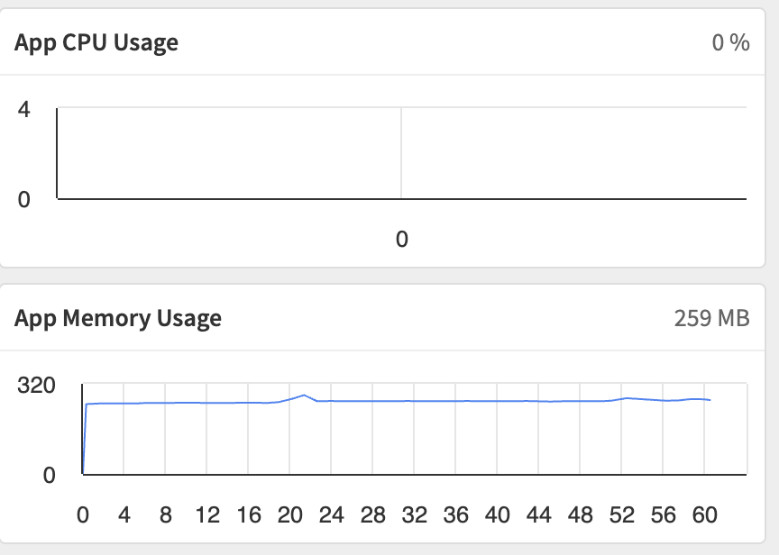

- Figure 56: Network Performance Graph

**Results:**
| Metric | Value |
|--------|--------|
| CPU Usage | CPU usage is unavailable for Huawei devices on BrowserStack. |
| Memory Usage | 257.44 MB |
| Response Time | < 1 s |

---       

#### Device: Google Pixel 8 - Android 14
**Figures:**
- Figure 57: CPU/Memory Graph

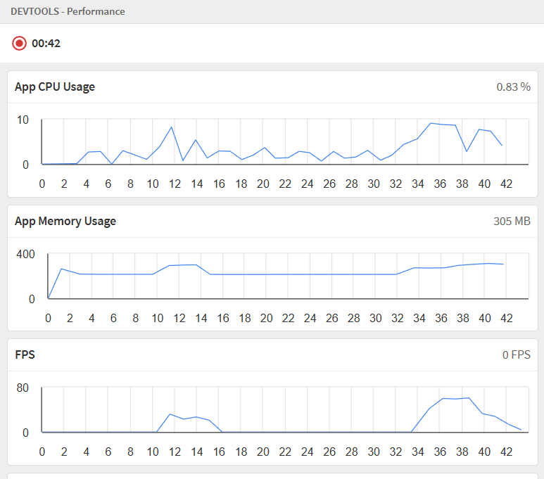

- Figure 58: Network Performance Graph

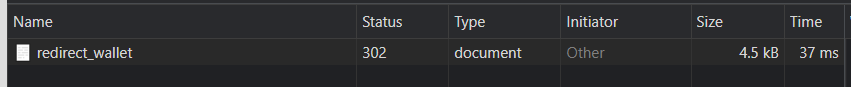

**Results:**
| Metric | Value |
|--------|--------|
| CPU Usage | 3.08% |
| Memory Usage | 249.59 MB |
| Response Time | < 1 s |

---

#### Device: iPhone 14 - iOS 26
**Figures:**
- Figure 59: CPU/Memory Graph

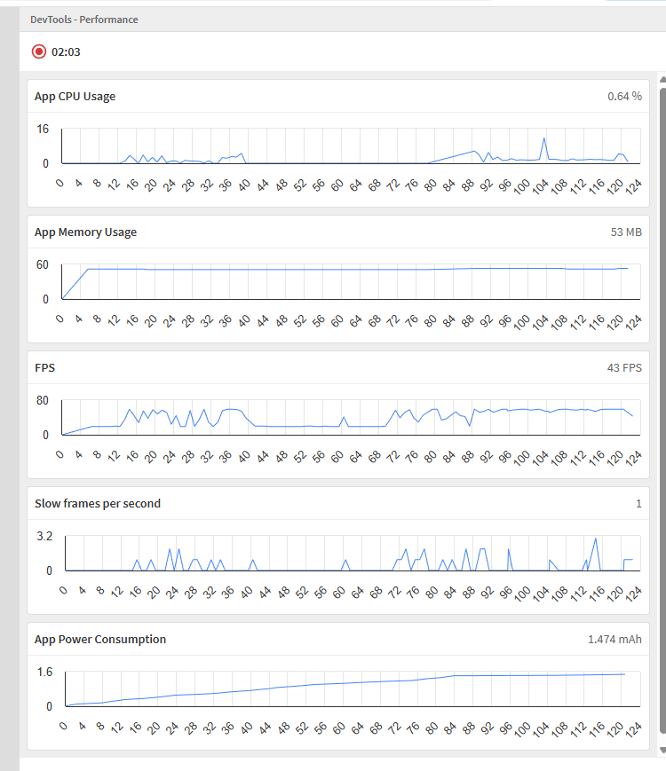

- Figure 60: Network Performance Graph

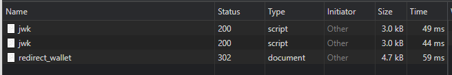

**Results:**
| Metric | Value |
|--------|--------|
| CPU Usage | 1.54% |
| Memory Usage | 52.06 MB |
| Response Time | < 1 s |

---

#### Device: iPhone 15 - iOS 17
**Figures:**
- Figure 61: CPU/Memory Graph

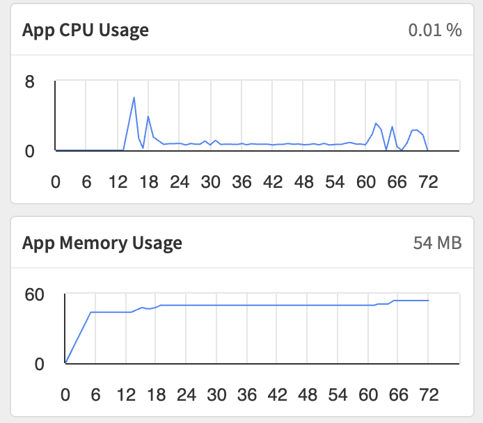

- Figure 62: Network Performance Graph

**Results:**
| Metric | Value |
|--------|--------|
| CPU Usage | 0.88% |
| Memory Usage | 49.92 MB |
| Response Time | < 1 s |

---

#### Device: iPhone 16 - iOS 18
**Figures:**
- Figure 63: CPU/Memory Graph

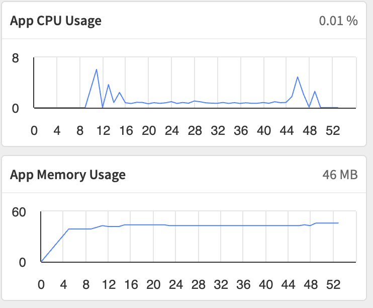

- Figure 64: Network Performance Graph

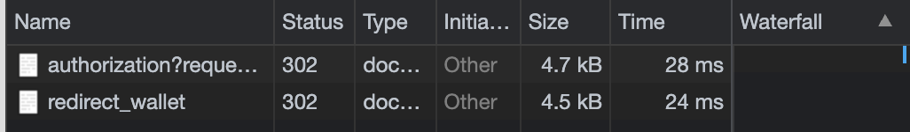

**Results:**
| Metric | Value |
|--------|--------|
| CPU Usage | 0.91% |
| Memory Usage | 43.57 MB |
| Response Time | < 1 s |

---

### Scenario 5: Pre-Authorization Code (Same Device)

#### Device: Samsung Galaxy A16 5G - Android 15
**Figures:**
- Figure 65: CPU/Memory Graph

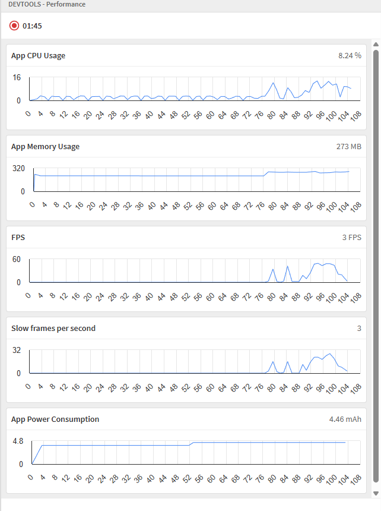

- Figure 66: Network Performance Graph

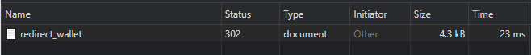

**Results:**
| Metric | Value |
|--------|--------|
| CPU Usage | 3.43% |
| Memory Usage | 229.91 MB |
| Response Time | < 1 s |

---

#### Device: Redmi Note 12 Pro - Android 12 (MIUI)
**Figures:**
- Figure 67: CPU/Memory Graph

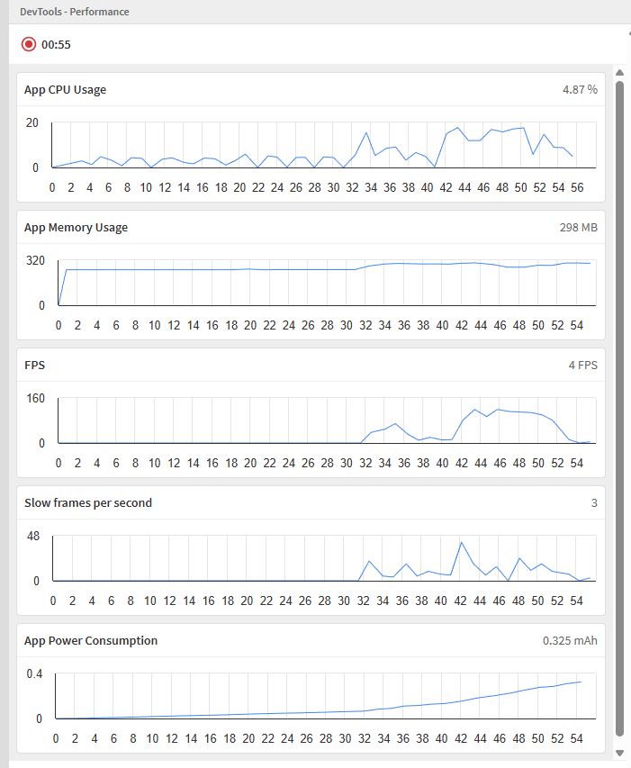

- Figure 68: Network Performance Graph

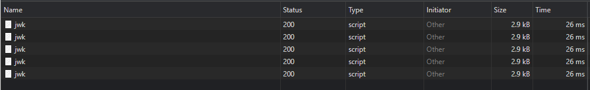

**Results:**
| Metric | Value |
|--------|--------|
| CPU Usage | 5.98% |
| Memory Usage | 271.11 MB |
| Response Time | < 1 s |

---

#### Device: OnePlus 11R - Android 13 (OxygenOS)
**Figures:**
- Figure 69: CPU/Memory Graph

- Figure 70: Network Performance Graph

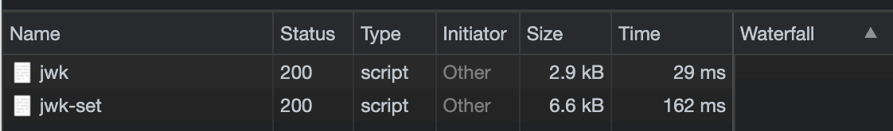

**Results:**
| Metric | Value |
|--------|--------|
| CPU Usage | 4.01% |
| Memory Usage | 225.41 MB |
| Response Time | < 1 s |

---

#### Device: Huawei Nova 13 - HarmonyOS 4 OS 12
**Figures:**
- Figure 71: CPU/Memory Graph

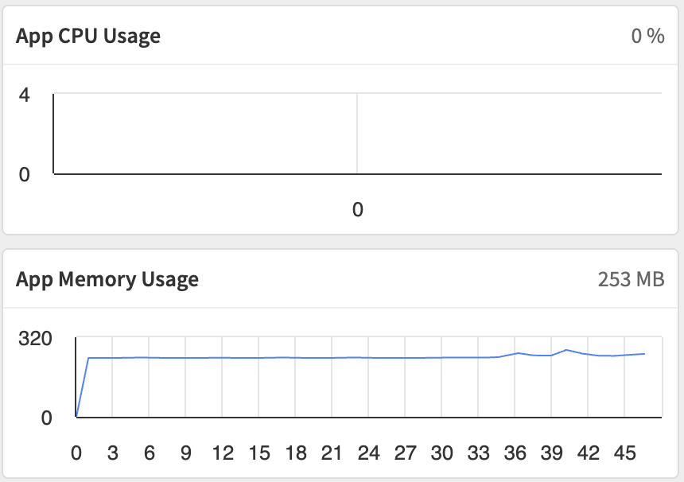

- Figure 72: Network Performance Graph

**Results:**
| Metric | Value |
|--------|--------|
| CPU Usage | CPU usage is unavailable for Huawei devices on BrowserStack. |
| Memory Usage | 241.34 MB |
| Response Time | < 1 s |

---

#### Device: Google Pixel 8 - Android 14
**Figures:**
- Figure 73: CPU/Memory Graph

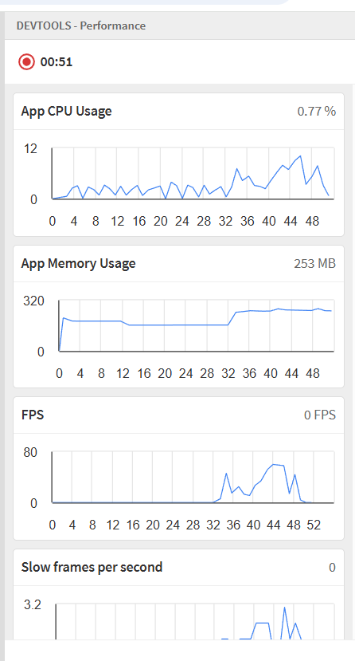

- Figure 74: Network Performance Graph

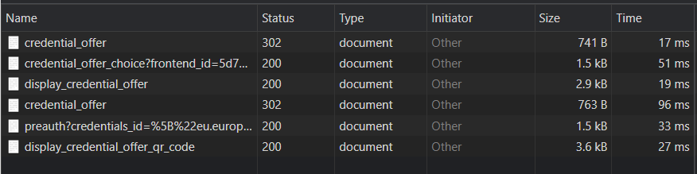

**Results:**
| Metric | Value |
|--------|--------|
| CPU Usage | 2.74% |
| Memory Usage | 219.65 MB |
| Response Time | < 1 s |

---

#### Device: iPhone 14 - iOS 26
**Figures:**
- Figure 75: CPU/Memory Graph

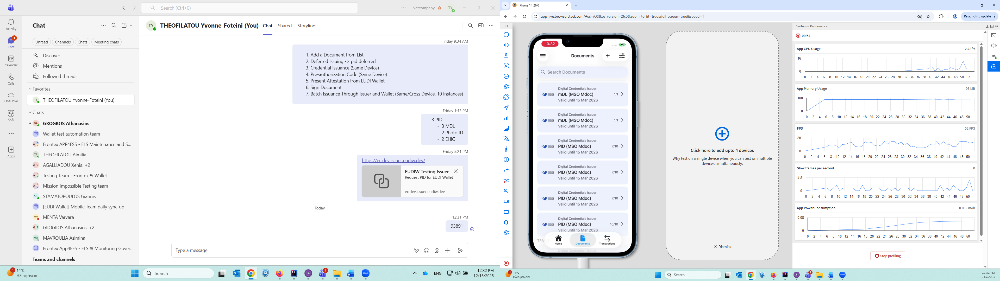

- Figure 76: Network Performance Graph

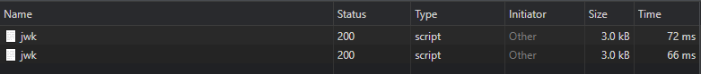

**Results:**
| Metric | Value |
|--------|--------|
| CPU Usage | 1.59% |
| Memory Usage | 90.43 MB |
| Response Time | < 1 s |

---

#### Device: iPhone 15 - iOS 17
**Figures:**
- Figure 77: CPU/Memory Graph

- Figure 78: Network Performance Graph

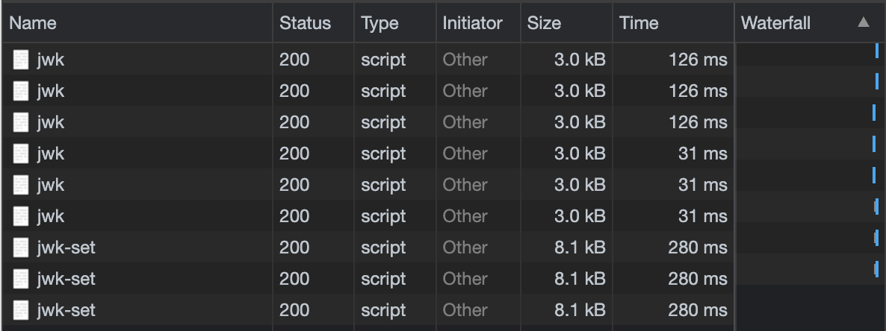

**Results:**
| Metric | Value |
|--------|--------|
| CPU Usage | 0.93% |
| Memory Usage | 49.44 MB |
| Response Time | < 1 s |

---

#### Device: iPhone 16 - iOS 18
**Figures:**
- Figure 79: CPU/Memory Graph

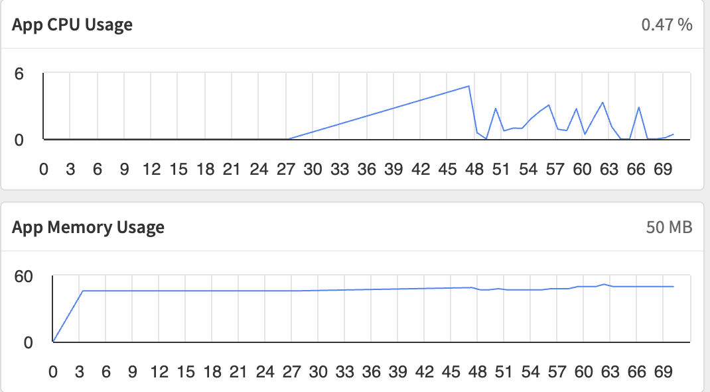

- Figure 80: Network Performance Graph

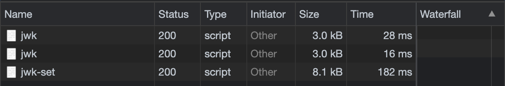

**Results:**
| Metric | Value |
|--------|--------|
| CPU Usage | 0.83% |
| Memory Usage | 48.32 MB |
| Response Time | < 1 s |

---

### Scenario 6: Present Attestation from EUDI Wallet

#### Device: POCO X5 Pro 5G - Android 14
**Figures:**
- Figure 81: CPU/Memory Graph

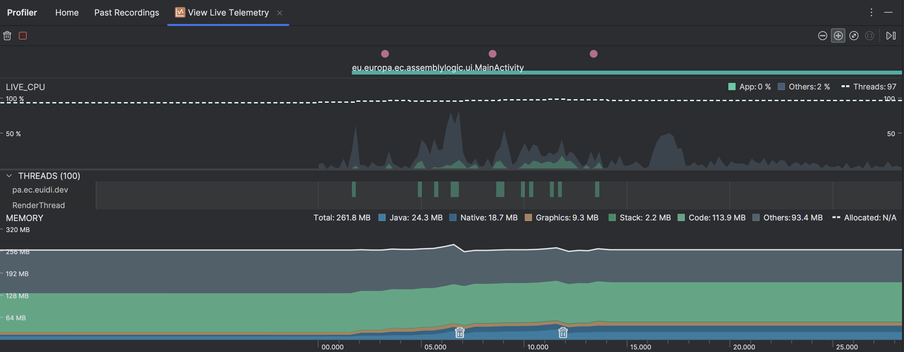

- Figure 82: Network Performance Graph

**Results:**
| Metric | Value |
|--------|--------|
| CPU Usage | 0.1% |
| Memory Usage | 261.8 MB |
| Response Time | < 1 s |

---

#### Device: iPhone 14 Plus - iOS 18
**Figures:**
- Figure 83: CPU/Memory Graph

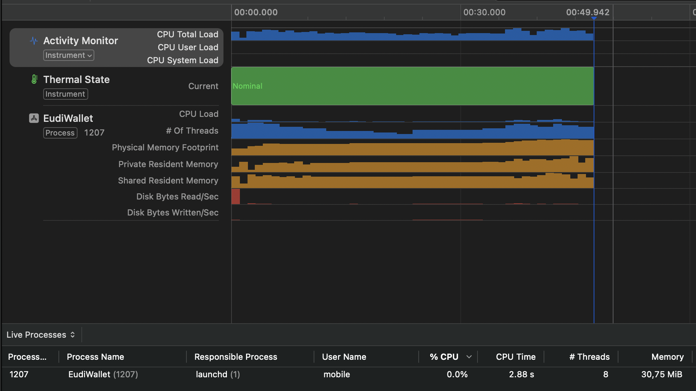

- Figure 84: Network Performance Graph

**Results:**
| Metric | Value |
|--------|--------|
| CPU Usage | 0.1% |
| Memory Usage | 30.75 MB |
| Response Time | < 1 s |

---

### Scenario 7: Sign Document

#### Device: Samsung Galaxy A16 5G - Android 15
**Figures:**
- Figure 85: CPU/Memory Graph

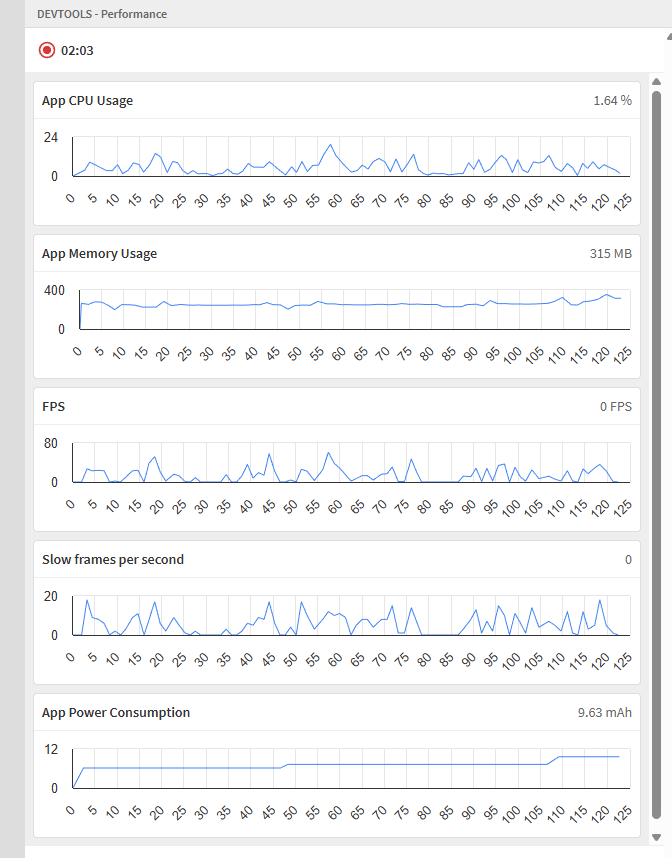

- Figure 86: Network Performance Graph

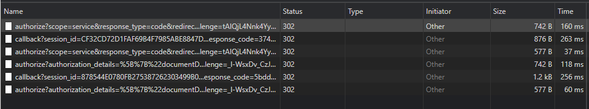

**Results:**
| Metric | Value |
|--------|--------|
| CPU Usage | 5.34% |
| Memory Usage | 255.49 MB |
| Response Time | < 1 s |

---

#### Device: Redmi Note 12 Pro - Android 12 (MIUI)
**Figures:**
- Figure 87: CPU/Memory Graph

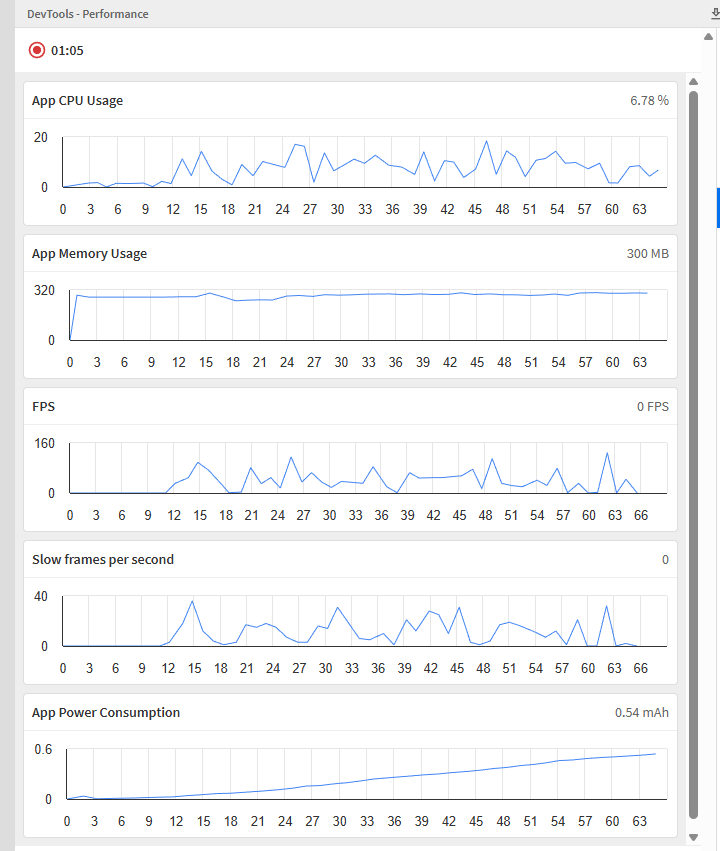

- Figure 88: Network Performance Graph

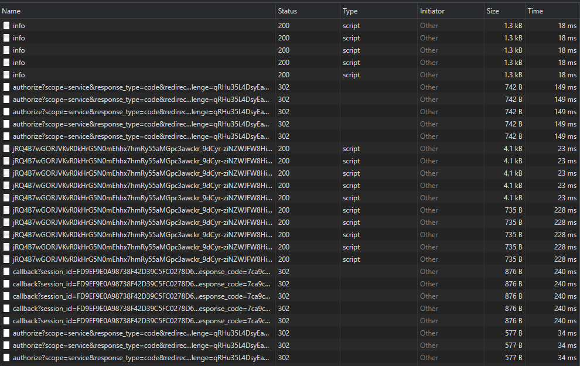
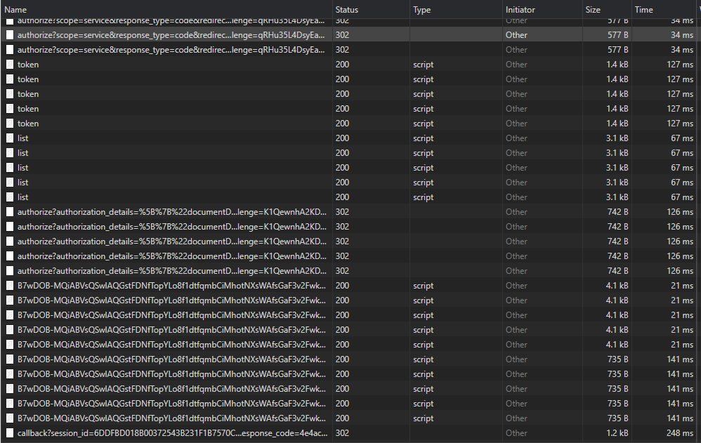
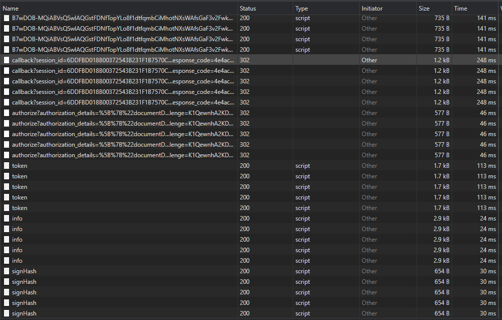

**Results:**
| Metric | Value |
|--------|--------|
| CPU Usage | 6.91% |
| Memory Usage | 285.82 MB |
| Response Time | < 1 s |

---

#### Device: OnePlus 11R - Android 13 (OxygenOs)
**Figures:**
- Figure 91: CPU/Memory Graph

- Figure 92: Network Performance Graph

**Results:**
| Metric | Value |
|--------|--------|
| CPU Usage | 5.99% |
| Memory Usage | 215.71 MB |
| Response Time | < 1 s |

---

#### Device: Huawei Nova 13 - HarmonyOS 4 OS 12
**Figures:**
- Figure 93: CPU/Memory Graph

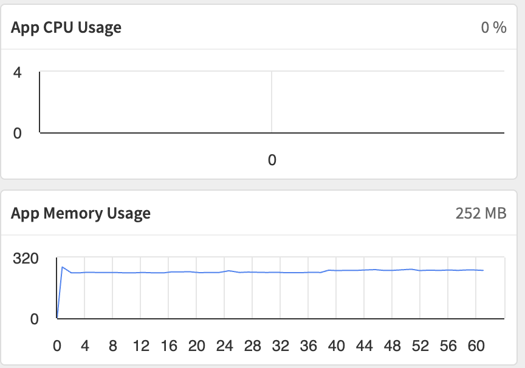

- Figure 94: Network Performance Graph

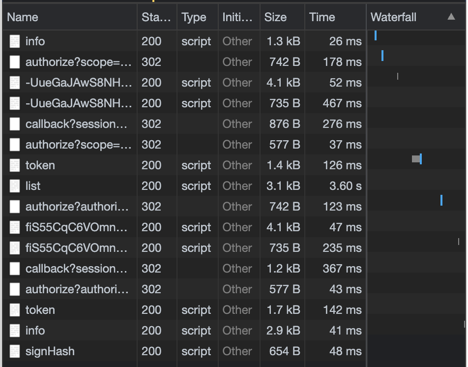

**Results:**
| Metric | Value |
|--------|--------|
| CPU Usage | CPU usage is unavailable for Huawei devices on BrowserStack. |
| Memory Usage | 246.77 MB |
| Response Time | < 1 s |

---

#### Device: Google Pixel 8 - Android 14
**Figures:**
- Figure 95: CPU/Memory Graph

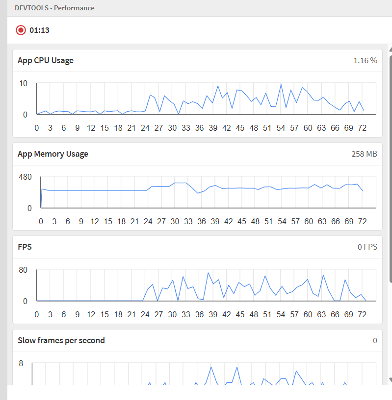

- Figure 96: Network Performance Graph

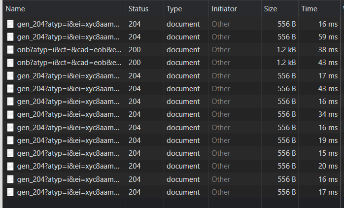

**Results:**
| Metric | Value |
|--------|--------|
| CPU Usage | 2.78% |
| Memory Usage | 295.92 MB |
| Response Time | < 1 s |

---

#### Device: iPhone 14 - iOS 26
**Figures:**
- Figure 97: CPU/Memory Graph

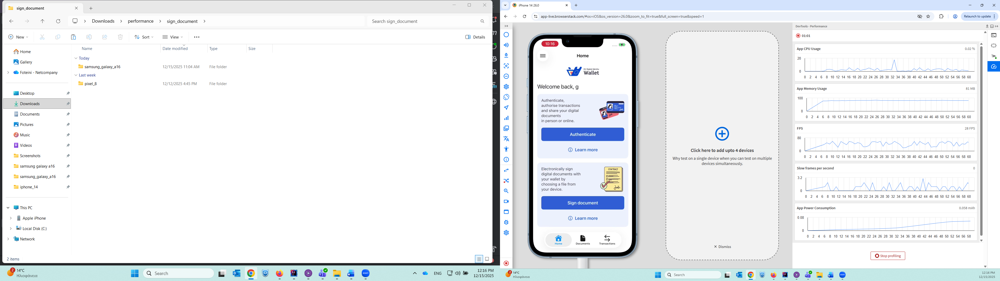

- Figure 98: Network Performance Graph

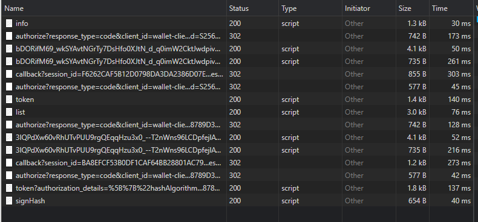

**Results:**
| Metric | Value |
|--------|--------|
| CPU Usage | 2.24% |
| Memory Usage | 81.28 MB |
| Response Time | < 1 s |

---

#### Device: iPhone 15 - iOS 17
**Figures:**
- Figure 99: CPU/Memory Graph

- Figure 100-01-02-03-04-05-06-07: Network Performance Graph

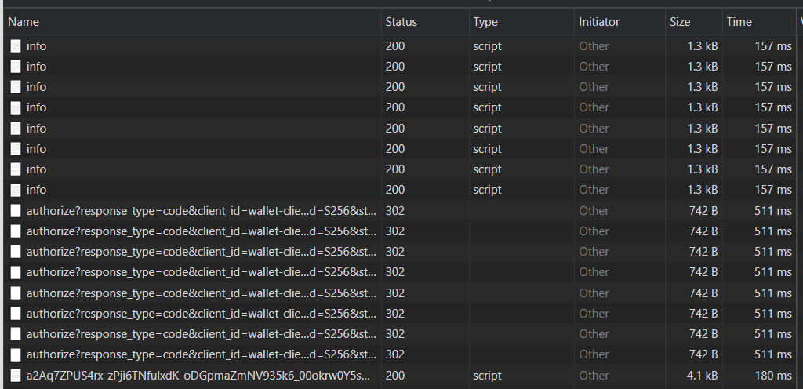


**Results:**
| Metric | Value |
|--------|--------|
| CPU Usage | 1.76% |
| Memory Usage | 63.91 MB |
| Response Time | < 1 s |

---

#### Device: iPhone 16 - iOS 18
**Figures:**
- Figure 108: CPU/Memory Graph


- Figure 109: Network Performance Graph


**Results:**
| Metric | Value |
|--------|--------|
| CPU Usage | 1.13% |
| Memory Usage | 53 MB |
| Response Time | < 1 s |

---

### Scenario 8: Batch Issuance Through Wallet (Same Device)

#### Device: Samsung Galaxy A16 5G - Android 15
**Figures:**
- Figure 110: CPU/Memory Graph

- Figure 111: Network Performance Graph


**Results:**
| Metric | Value |
|--------|--------|
| CPU Usage | 4.03% |
| Memory Usage | 237.18 MB |
| Response Time | < 1 s |

---

#### Device: Redmi Note 12 Pro - Android 12 (MIUI)
**Figures:**
- Figure 112: CPU/Memory Graph


- Figure 113: Network Performance Graph


**Results:**
| Metric | Value |
|--------|--------|
| CPU Usage | 6.28% |
| Memory Usage | 228.68 MB |
| Response Time | < 1 s |

---

#### Device: OnePlus 11R - Android 13 (OxygenOS)
**Figures:**
- Figure 114: CPU/Memory Graph


- Figure 115: Network Performance Graph


**Results:**
| Metric | Value |
|--------|--------|
| CPU Usage | 4.59% |
| Memory Usage | 234.72 MB |
| Response Time | < 1 s |

---

#### Device: Huawei Nova 13 - HarmonyOS 4 OS 12
**Figures:**
- Figure 116: CPU/Memory Graph

- Figure 117: Network Performance Graph


**Results:**
| Metric | Value |
|--------|--------|
| CPU Usage | CPU usage is unavailable for Huawei devices on BrowserStack. |
| Memory Usage | 257.62 MB |
| Response Time | < 1 s |

---

#### Device: Google Pixel 8 - Android 14
**Figures:**
- Figure 118: CPU/Memory Graph

- Figure 119: Network Performance Graph


**Results:**
| Metric | Value |
|--------|--------|
| CPU Usage | 3.51% |
| Memory Usage | 272.75 MB |
| Response Time | < 1 s |

---

#### Device: iPhone 14 - iOS 26
**Figures:**
- Figure 120: CPU/Memory Graph

- Figure 121: Network Performance Graph


**Results:**
| Metric | Value |
|--------|--------|
| CPU Usage | 5.06% |
| Memory Usage | 55.81 MB |
| Response Time | < 1 s |

---

#### Device: iPhone 15 - iOS 17
**Figures:**
- Figure 122: CPU/Memory Graph

- Figure 123: Network Performance Graph


**Results:**
| Metric | Value |
|--------|--------|
| CPU Usage | 2.06% |
| Memory Usage | 60.02 MB |
| Response Time | < 1 s |

---

#### Device: iPhone 16 - iOS 18
**Figures:**
- Figure 124: CPU/Memory Graph

- Figure 125: Network Performance Graph


**Results:**
| Metric | Value |
|--------|--------|
| CPU Usage | 1.57% |
| Memory Usage | 51.58 MB |
| Response Time | < 1 s |

---

### Scenario 9: Batch Issuance Through Verifier (Same Device)

#### Device: Samsung Galaxy A16 5G - Android 15
**Figures:**
- Figure 126: CPU/Memory Graph


- Figure 127: Network Performance Graph


**Results:**
| Metric | Value |
|--------|--------|
| CPU Usage | 3.57% |
| Memory Usage | 247.72 MB |
| Response Time | < 1 s |

---

#### Device: Redmi Note 12Pro - Android 12 (MIUI)
**Figures:**
- Figure 128: CPU/Memory Graph


- Figure 129: Network Performance Graph


**Results:**
| Metric | Value |
|--------|--------|
| CPU Usage | 6.83% |
| Memory Usage | 270.2 MB |
| Response Time | < 1 s |

---

#### Device: OnePlus 11R - Android 13 (OxygenOS)
**Figures:**
- Figure 130: CPU/Memory Graph


- Figure 131: Network Performance Graph

**Results:**
| Metric | Value |
|--------|--------|
| CPU Usage | 3.35% |
| Memory Usage | 237.25 MB |
| Response Time | < 1 s |

---

#### Device: Huawei Nova 13 - HarmonyOS 4 OS 12
**Figures:**
- Figure 133: CPU/Memory Graph


- Figure 134: Network Performance Graph


**Results:**
| Metric | Value |
|--------|--------|
| CPU Usage | CPU usage is unavailable for Huawei devices on BrowserStack. |
| Memory Usage | 256.27 MB |
| Response Time | < 1 s |

---

#### Device: Google Pixel 8 -Android 14
**Figures:**
- Figure 135: CPU/Memory Graph


- Figure 136: Network Performance Graph

**Results:**
| Metric | Value |
|--------|--------|
| CPU Usage | 2.62% |
| Memory Usage | 252.89 MB |
| Response Time | < 1 s |

---

#### Device: iPhone 14 - iOS 26
**Figures:**
- Figure 137: CPU/Memory Graph


- Figure 138: Network Performance Graph


**Results:**
| Metric | Value |
|--------|--------|
| CPU Usage | 1.34% |
| Memory Usage | 58.58 MB |
| Response Time | < 1 s |

---

#### Device: iPhone 15 - iOS 17
**Figures:**
- Figure 139: CPU/Memory Graph


- Figure 140: Network Performance Graph


**Results:**
| Metric | Value |
|--------|--------|
| CPU Usage | 1.32% |
| Memory Usage | 55.4 MB |
| Response Time | < 1 s |

---

#### Device: iPhone 16 - iOS 18
**Figures:**
- Figure 141: CPU/Memory Graph


- Figure 142: Network Performance Graph


**Results:**
| Metric | Value |
|--------|--------|
| CPU Usage | 1.17% |
| Memory Usage | 62.29 MB |
| Response Time | < 1 s |

---

### Scenario 10: Batch Issuance Through Verifier (Cross Device)

#### Device: POCO X5 Pro 5G - Android 14
**Figures:**
- Figure 143: CPU/Memory Graph

- Figure 144: Network Performance Graph


**Results:**
| Metric | Value |
|--------|--------|
| CPU Usage | 0.1% |
| Memory Usage | 261.8 MB |
| Response Time | < 1 s |

---

#### Device: iPhone 14 Plus - iOS 18
**Figures:**
- Figure 145: CPU/Memory Graph

- Figure 146: Network Performance Graph

**Results:**
| Metric | Value |
|--------|--------|
| CPU Usage | 0.1% |
| Memory Usage | 30.75 MB |
| Response Time | < 1 s |

---

### Scenario 11: Batch Issuance Through Issuer (Cross Device)

#### Device: POCO X5 Pro 5G - Android 14
**Figures:**
- Figure 147: CPU/Memory Graph


- Figure 148: Network Performance Graph


**Results:**
| Metric | Value |
|--------|--------|
| CPU Usage | 0.1% |
| Memory Usage | 276.5 MB |
| Response Time | < 1 s |

---

#### Device: iPhone 14 Plus - iOS 18
**Figures:**
- Figure 149: CPU/Memory Graph

- Figure 150: Network Performance Graph


**Results:**
| Metric | Value |
|--------|--------|
| CPU Usage | 0.1% |
| Memory Usage | 37.05 MB |
| Response Time | < 1 s |

---

# 7. Conclusion and Comments

Based on the collected performance metrics, the **EUDI Wallet application** demonstrates strong stability and efficiency across both platforms (Android and iOS).

### Summary of Findings
- **Response Time:** Remained consistently under 1 second in all test scenarios (well below the 2.0s acceptance limit).
- **Stability:** No crashes or critical errors occurred during any test runs.
- **Network Behavior:** All network requests were limited to expected dev endpoints (issuer/verifier).
- **Resource Usage:** CPU and memory remained within acceptable limits for all devices, even under repeated load.

### Overall Conclusion
The application successfully meets all defined **performance acceptance criteria** and exhibits robust, efficient behavior across devices and platforms.  
No significant performance issues were detected during testing.

---

## References
- [requirements.md](requirements.md)
- [specifications.md](specifications.md)
