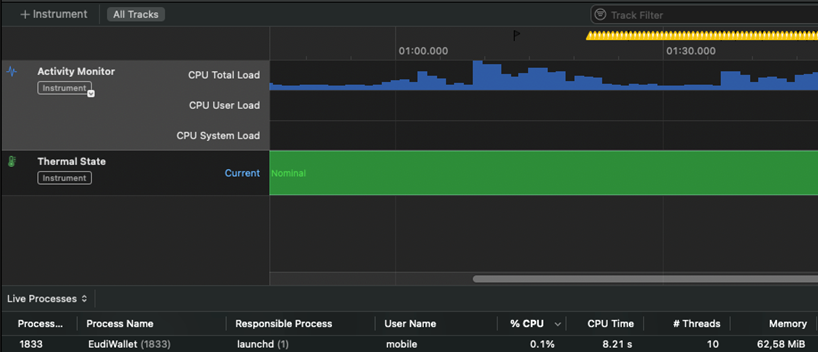
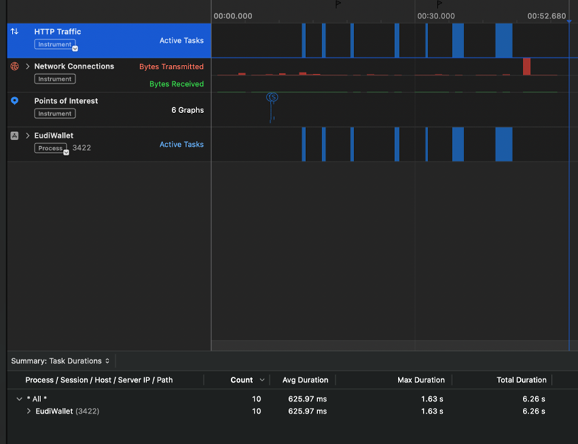

## Test Run – Performance Metrics

### Scenario 1: Add a Document from List

#### Device: POCO X5 Pro 5G
**Figures:**
- Figure 1: CPU/Memory Graph

- Figure 2: Network Performance Graph

**Results:**
| Metric | Value |
|--------|--------|
| CPU Usage | 4% |
| Memory Usage | 234.1 MB |
| Response Time | < 1 s |

---

#### Device: iPhone 14 Plus
**Figures:**
- Figure 3: CPU/Memory Graph

- Figure 4: Network Performance Graph

**Results:**
| Metric | Value |
|--------|--------|
| CPU Usage | 0.1% |
| Memory Usage | 57.64 MB |
| Response Time | < 1 s |

---

### Scenario 2: Deferred Issuing

#### Device: POCO X5 Pro 5G
**Figures:**
- Figure 5: CPU/Memory Graph

- Figure 6: Network Performance Graph

**Results:**
| Metric | Value |
|--------|--------|
| CPU Usage | 10% |
| Memory Usage | 231.8 MB |
| Response Time | < 1 s |

---

#### Device: iPhone 14 Plus
**Figures:**
- Figure 7: CPU/Memory Graph

- Figure 8: Network Performance Graph

**Results:**
| Metric | Value |
|--------|--------|
| CPU Usage | 18.8% |
| Memory Usage | 55.47 MB |
| Response Time | < 1 s |

---

### Scenario 3: Credential Issuance (Same Device)

#### Device: POCO X5 Pro 5G
**Figures:**
- Figure 9: CPU/Memory Graph

- Figure 10: Network Performance Graph

**Results:**
| Metric | Value |
|--------|--------|
| CPU Usage | 3% |
| Memory Usage | 210.3 MB |
| Response Time | < 1 s |

---

#### Device: iPhone 14 Plus
**Figures:**
- Figure 11: CPU/Memory Graph

- Figure 12: Network Performance Graph

**Results:**
| Metric | Value |
|--------|--------|
| CPU Usage | 0.1% |
| Memory Usage | 57.47 MB |
| Response Time | < 1 s |

---

### Scenario 4: Dynamic Issuance Process

#### Device: POCO X5 Pro 5G
**Figures:**
- Figure 13: CPU/Memory Graph

- Figure 14: Network Performance Graph

**Results:**
| Metric | Value |
|--------|--------|
| CPU Usage | 0% |
| Memory Usage | 161.5 MB |
| Response Time | < 1 s |

---

#### Device: iPhone 14 Plus
**Figures:**
- Figure 15: CPU/Memory Graph

- Figure 16: Network Performance Graph

**Results:**
| Metric | Value |
|--------|--------|
| CPU Usage | 0.1% |
| Memory Usage | 50.36 MB |
| Response Time | < 1 s |

---

### Scenario 5: Pre-Authorization Code (Same Device)

#### Device: POCO X5 Pro 5G
**Figures:**
- Figure 17: CPU/Memory Graph

- Figure 18: Network Performance Graph

**Results:**
| Metric | Value |
|--------|--------|
| CPU Usage | 1% |
| Memory Usage | 213.2 MB |
| Response Time | < 1 s |

---

#### Device: iPhone 14 Plus
**Figures:**
- Figure 19: CPU/Memory Graph

- Figure 20: Network Performance Graph

**Results:**
| Metric | Value |
|--------|--------|
| CPU Usage | 0.1% |
| Memory Usage | 50.64 MB |
| Response Time | < 1 s |

---

### Scenario 6: Present Attestation from EUDI Wallet

#### Device: POCO X5 Pro 5G
**Figures:**
- Figure 21: CPU/Memory Graph

- Figure 22: Network Performance Graph

**Results:**
| Metric | Value |
|--------|--------|
| CPU Usage | 5% |
| Memory Usage | 213.2 MB |
| Response Time | < 1 s |

---

#### Device: iPhone 14 Plus
**Figures:**
- Figure 23: CPU/Memory Graph

- Figure 24: Network Performance Graph

**Results:**
| Metric | Value |
|--------|--------|
| CPU Usage | 0% |
| Memory Usage | 58.24 MB |
| Response Time | < 1 s |

---

### Scenario 7: Sign Document

#### Device: POCO X5 Pro 5G
**Figures:**
- Figure 25: CPU/Memory Graph

- Figure 26: Network Performance Graph

- Figure 27: Additional Network Performance Graph

**Results:**
| Metric | Value |
|--------|--------|
| CPU Usage | 0% |
| Memory Usage | 229.6 MB |
| Response Time | < 1 s |

---

#### Device: iPhone 14 Plus
**Figures:**
- Figure 28: CPU/Memory Graph

- Figure 29: Network Performance Graph

**Results:**
| Metric | Value |
|--------|--------|
| CPU Usage | 0.1% |
| Memory Usage | 62.58 MB |
| Response Time | < 1 s |

---

# 7. Conclusion and Comments

Based on the collected performance metrics, the **EUDI Wallet application** demonstrates strong stability and efficiency across both platforms (Android and iOS).

### Summary of Findings
- **Response Time:** Remained consistently under 1 second in all test scenarios (well below the 2.0s acceptance limit).
- **Stability:** No crashes or critical errors occurred during any test runs.
- **Network Behavior:** All network requests were limited to expected production endpoints (issuer/verifier).
- **Resource Usage:** CPU and memory remained within acceptable limits for all devices, even under repeated load.

### Overall Conclusion
The application successfully meets all defined **performance acceptance criteria** and exhibits robust, efficient behavior across devices and platforms.  
No significant performance issues were detected during testing.

---

## References
- [requirements.md](requirements.md)
- [specifications.md](specifications.md)
- [Performance Test Report (Figures 1–29)](https://github.com/eu-digital-identity-wallet/eudi-doc-developers-hub-site/blob/doc_update/docs/Reference%20Implementation/Quality%20Assurance.md#-reporting)