## Test Run – Performance Metrics

## Definitions

The following definitions are listed to clarify important terms used throughout this document.  
These terms are aligned with the **EUDI Architecture and Reference Framework [R01]**.

| **Acronym** | **Definition** |
|--------------|----------------|
| **EUDI Wallet User** | Citizen/Natural person using the EUDI Wallet to receive, store and present attestations (PID, QEAA or EAA) about themselves, including to prove their identity. |
| **Issuer** | A Person Identification Data Provider issuing PID or a (Qualified) Trust Service Provider issuing (Q)EAA. In the case of the EUDI Wallet, there may be multiple Issuers for PID and (Q)EAA. |
| **mDL Provider** | mDL Providers maintain an interface for requesting and providing mDL to EUDI Wallets. |
| **PID** | A set of data enabling the identity of a natural person, or a natural person representing a legal person — eIDAS Regulation. |
| **PID Provider** | A Member State or legal entity providing Person Identification Data to Users. |
| **Relying Party** | Private or Public party providing online services, intending to utilize the EUDI Wallet for user identification and authentication purposes. |

## Test Environment

The following specifications describe the environment in which performance testing was conducted.

### Android Environment
- **Device Used:** POCO X5 Pro 5G
- **Connection:** Connected to PC with IDE
- **Tools Used:** Android Studio Profiler and App Inspection
- **Network:** Wi-Fi
- **Test Data:**
    - Simulated EUDI Wallet application with 10 documents
    - Production Issuer: [https://issuer.eudiw.dev/credential_offer_choice](https://issuer.eudiw.dev/credential_offer_choice)
    - Production Verifier: [https://verifier.eudiw.dev/home](https://verifier.eudiw.dev/home)

### iOS Environment
- **Device Used:** iPhone 14 Plus
- **Connection:** Connected to PC with IDE
- **Tools Used:** Xcode Instruments
- **Network:** Wi-Fi
- **Test Data:**
    - Simulated EUDI Wallet application with 10 documents
    - Production Issuer: [https://issuer.eudiw.dev/credential_offer_choice](https://issuer.eudiw.dev/credential_offer_choice)
    - Production Verifier: [https://verifier.eudiw.dev/home](https://verifier.eudiw.dev/home)

## Test Execution and Results

### Scenario 1: Add a Document from List

#### Device: POCO X5 Pro 5G
**Figures:**
- Figure 1: CPU/Memory Graph

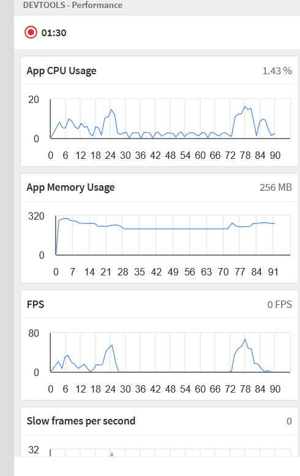

- Figure 2: Network Performance Graph

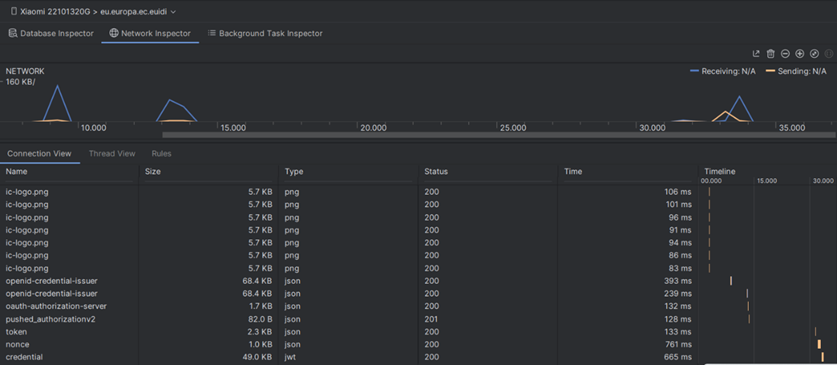

**Results:**
| Metric | Value |
|--------|--------|
| CPU Usage | 4% |
| Memory Usage | 234.1 MB |
| Response Time | < 1 s |

---

#### Device: iPhone 14 Plus
**Figures:**
- Figure 3: CPU/Memory Graph

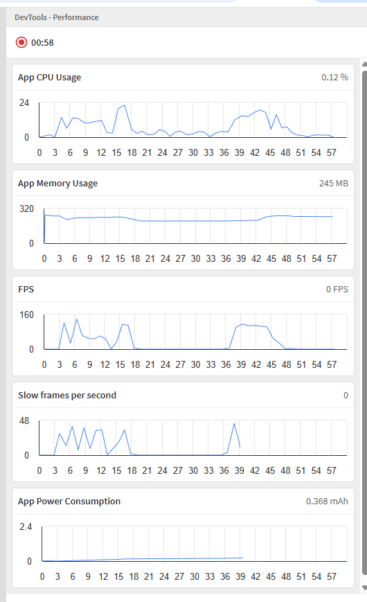

- Figure 4: Network Performance Graph

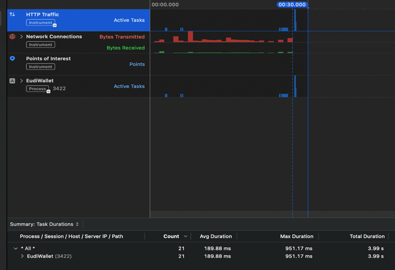

**Results:**
| Metric | Value |
|--------|--------|
| CPU Usage | 0.1% |
| Memory Usage | 57.64 MB |
| Response Time | < 1 s |

---

### Scenario 2: Deferred Issuing

#### Device: POCO X5 Pro 5G
**Figures:**
- Figure 5: CPU/Memory Graph

- Figure 6: Network Performance Graph

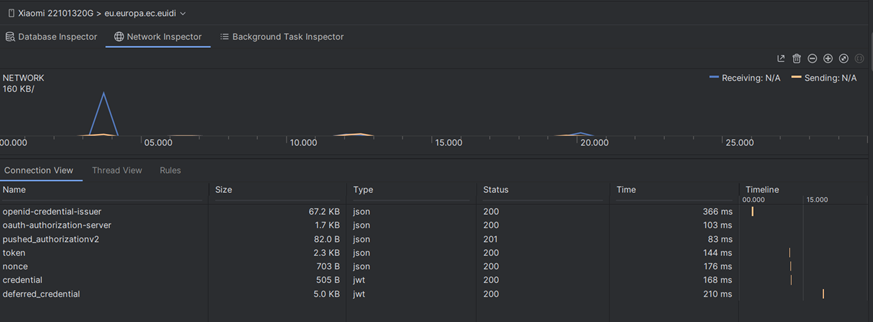

**Results:**
| Metric | Value |
|--------|--------|
| CPU Usage | 10% |
| Memory Usage | 231.8 MB |
| Response Time | < 1 s |

---

#### Device: iPhone 14 Plus
**Figures:**
- Figure 7: CPU/Memory Graph

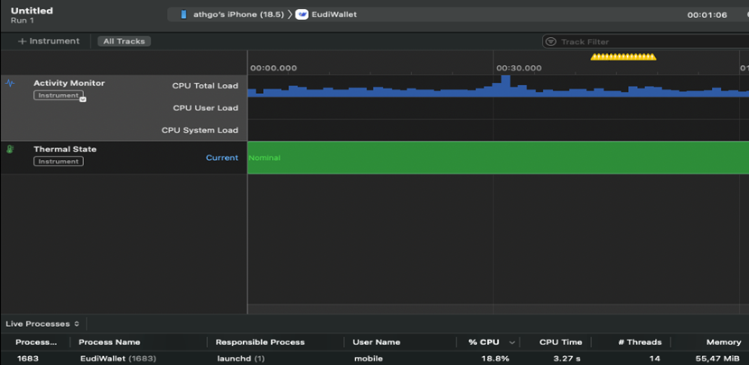

- Figure 8: Network Performance Graph

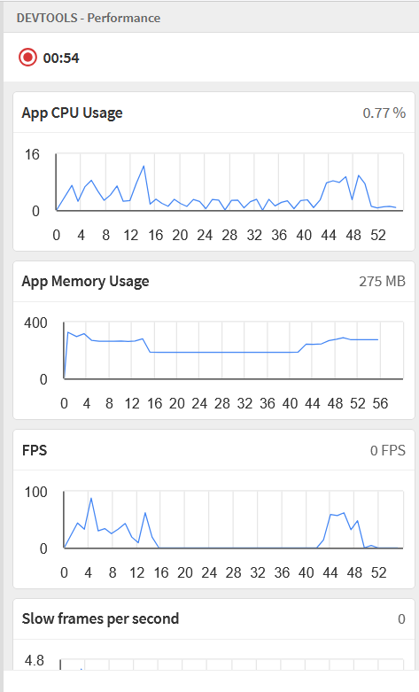

**Results:**
| Metric | Value |
|--------|--------|
| CPU Usage | 18.8% |
| Memory Usage | 55.47 MB |
| Response Time | < 1 s |

---

### Scenario 3: Credential Issuance (Same Device)

#### Device: POCO X5 Pro 5G
**Figures:**
- Figure 9: CPU/Memory Graph

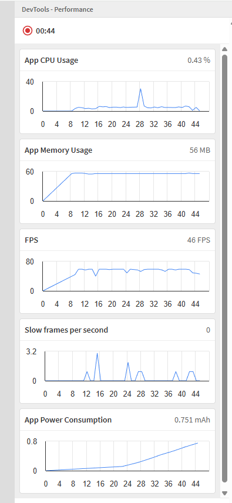

- Figure 10: Network Performance Graph

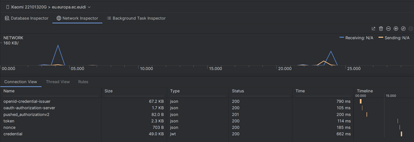

**Results:**
| Metric | Value |
|--------|--------|
| CPU Usage | 3% |
| Memory Usage | 210.3 MB |
| Response Time | < 1 s |

---

#### Device: iPhone 14 Plus
**Figures:**
- Figure 11: CPU/Memory Graph

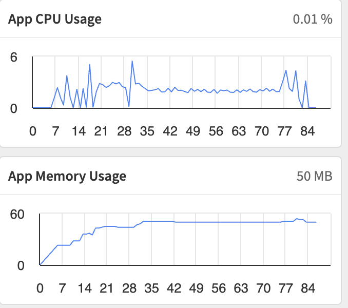

- Figure 12: Network Performance Graph

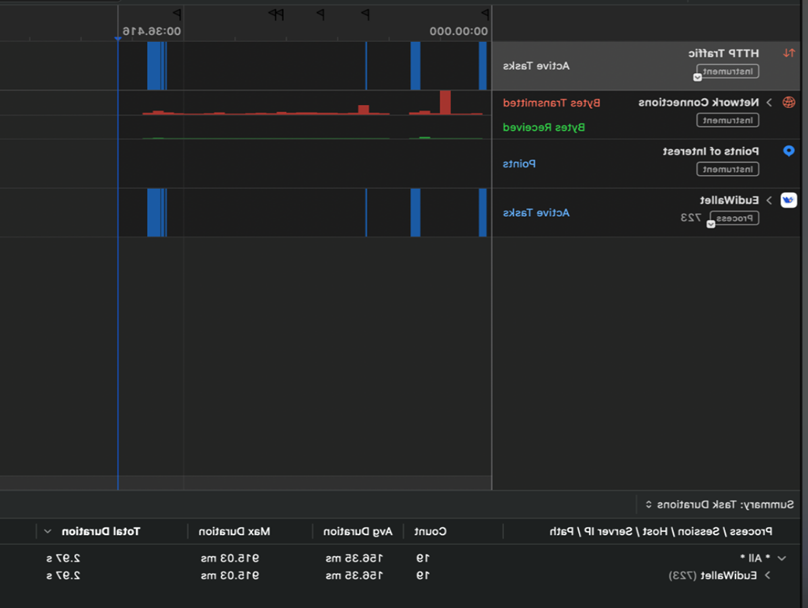

**Results:**
| Metric | Value |
|--------|--------|
| CPU Usage | 0.1% |
| Memory Usage | 57.47 MB |
| Response Time | < 1 s |

---

### Scenario 4: Dynamic Issuance Process

#### Device: POCO X5 Pro 5G
**Figures:**
- Figure 13: CPU/Memory Graph

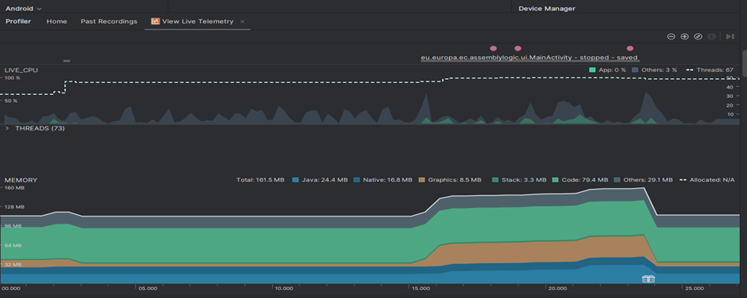

- Figure 14: Network Performance Graph

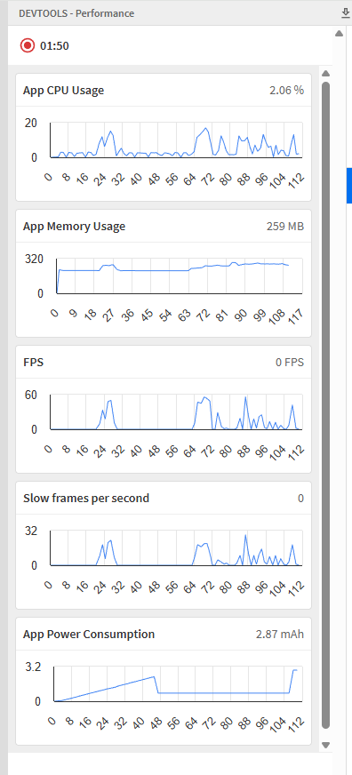

**Results:**
| Metric | Value |
|--------|--------|
| CPU Usage | 0% |
| Memory Usage | 161.5 MB |
| Response Time | < 1 s |

---

#### Device: iPhone 14 Plus
**Figures:**
- Figure 15: CPU/Memory Graph

- Figure 16: Network Performance Graph

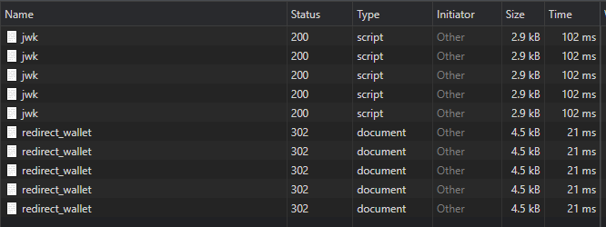

**Results:**
| Metric | Value |
|--------|--------|
| CPU Usage | 0.1% |
| Memory Usage | 50.36 MB |
| Response Time | < 1 s |

---

### Scenario 5: Pre-Authorization Code (Same Device)

#### Device: POCO X5 Pro 5G
**Figures:**
- Figure 17: CPU/Memory Graph

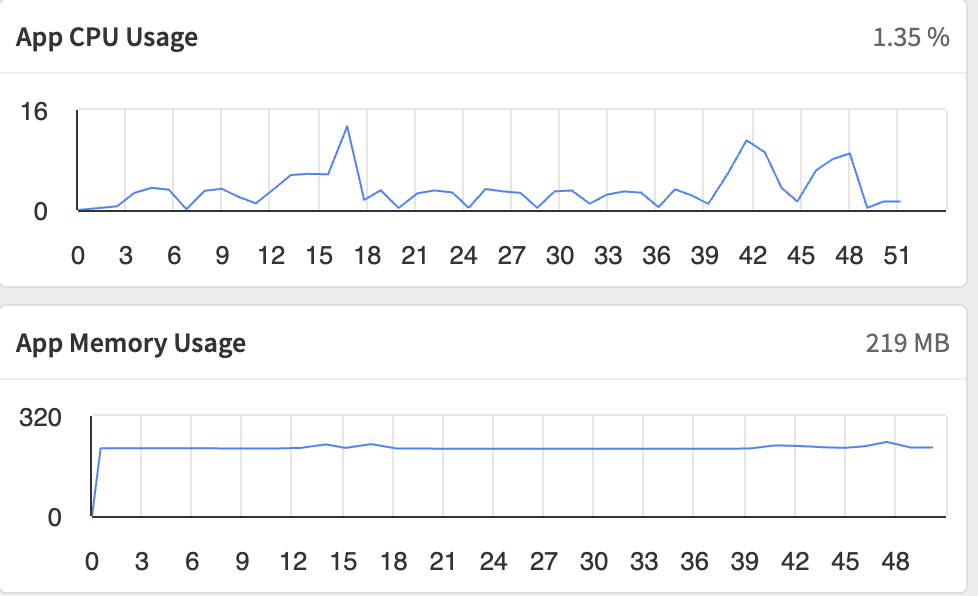

- Figure 18: Network Performance Graph

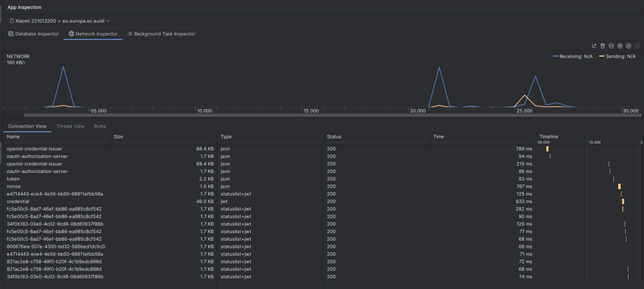

**Results:**
| Metric | Value |
|--------|--------|
| CPU Usage | 1% |
| Memory Usage | 213.2 MB |
| Response Time | < 1 s |

---

#### Device: iPhone 14 Plus
**Figures:**
- Figure 19: CPU/Memory Graph

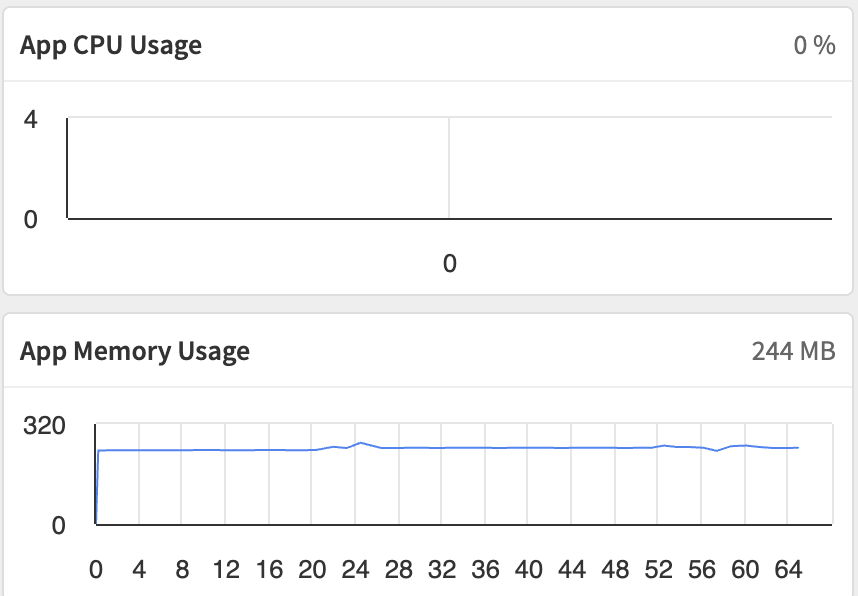

- Figure 20: Network Performance Graph

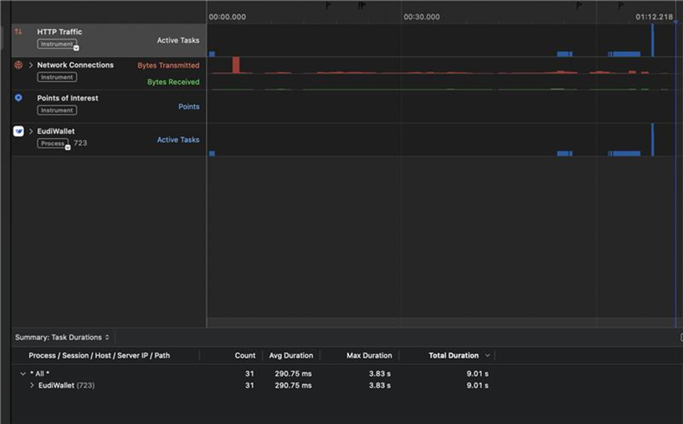

**Results:**
| Metric | Value |
|--------|--------|
| CPU Usage | 0.1% |
| Memory Usage | 50.64 MB |
| Response Time | < 1 s |

---

### Scenario 6: Present Attestation from EUDI Wallet

#### Device: POCO X5 Pro 5G
**Figures:**
- Figure 21: CPU/Memory Graph

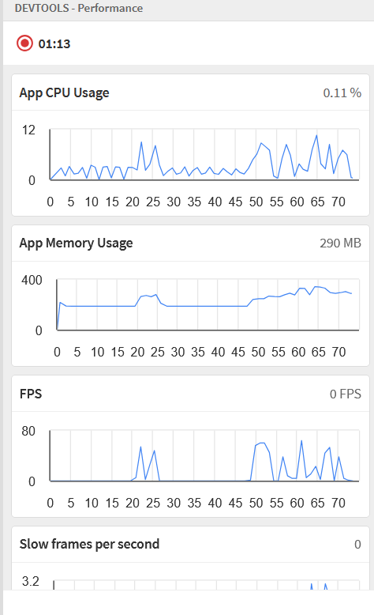

- Figure 22: Network Performance Graph

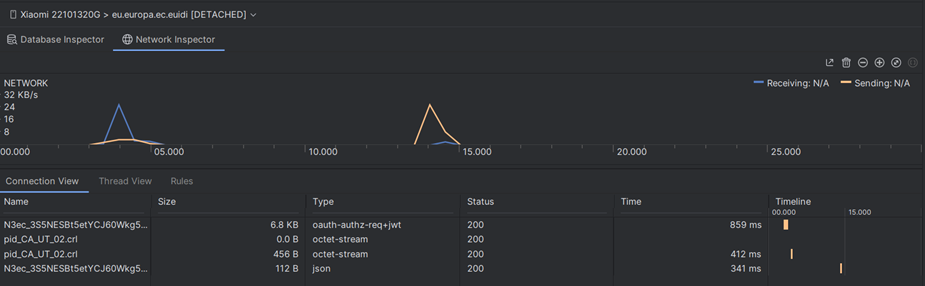

**Results:**
| Metric | Value |
|--------|--------|
| CPU Usage | 5% |
| Memory Usage | 213.2 MB |
| Response Time | < 1 s |

---

#### Device: iPhone 14 Plus
**Figures:**
- Figure 23: CPU/Memory Graph

- Figure 24: Network Performance Graph

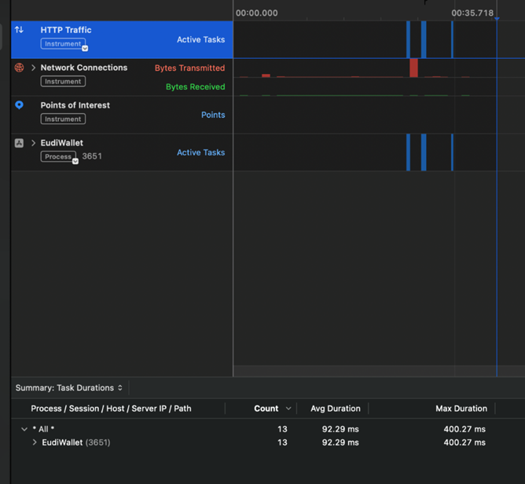

**Results:**
| Metric | Value |
|--------|--------|
| CPU Usage | 0% |
| Memory Usage | 58.24 MB |
| Response Time | < 1 s |

---

### Scenario 7: Sign Document

#### Device: POCO X5 Pro 5G
**Figures:**
- Figure 25: CPU/Memory Graph

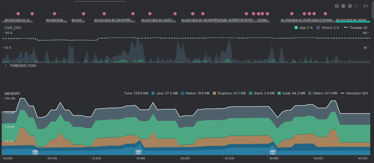

- Figure 26: Network Performance Graph

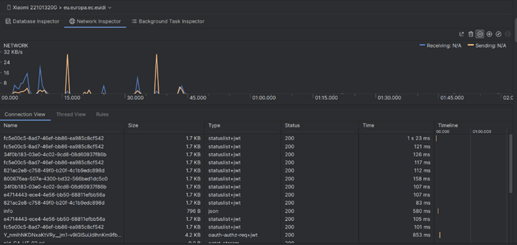

- Figure 27: Additional Network Performance Graph

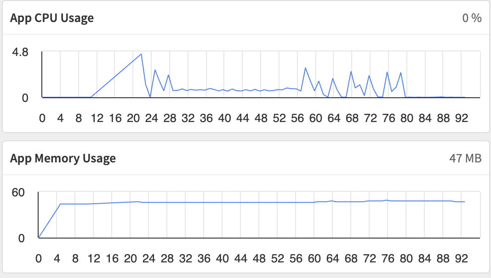

**Results:**
| Metric | Value |
|--------|--------|
| CPU Usage | 0% |
| Memory Usage | 229.6 MB |
| Response Time | < 1 s |

---

#### Device: iPhone 14 Plus
**Figures:**
- Figure 28: CPU/Memory Graph

- Figure 29: Network Performance Graph

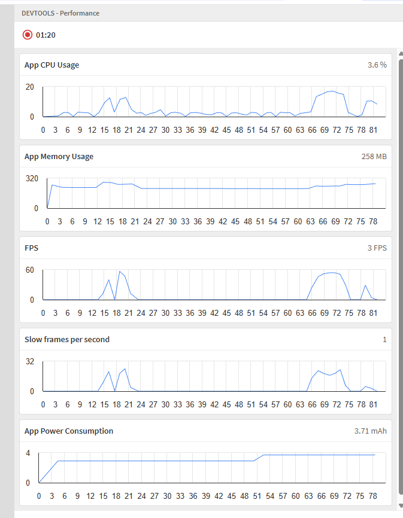

**Results:**
| Metric | Value |
|--------|--------|
| CPU Usage | 0.1% |
| Memory Usage | 62.58 MB |
| Response Time | < 1 s |

---

# 7. Conclusion and Comments

Based on the collected performance metrics, the **EUDI Wallet application** demonstrates strong stability and efficiency across both platforms (Android and iOS).

### Summary of Findings
- **Response Time:** Remained consistently under 1 second in all test scenarios (well below the 2.0s acceptance limit).
- **Stability:** No crashes or critical errors occurred during any test runs.
- **Network Behavior:** All network requests were limited to expected production endpoints (issuer/verifier).
- **Resource Usage:** CPU and memory remained within acceptable limits for all devices, even under repeated load.

### Overall Conclusion
The application successfully meets all defined **performance acceptance criteria** and exhibits robust, efficient behavior across devices and platforms.  
No significant performance issues were detected during testing.

---

## References
- [requirements.md](requirements.md)
- [specifications.md](specifications.md)
- [Performance Test Report (Figures 1–29)](https://github.com/eu-digital-identity-wallet/eudi-doc-developers-hub-site/blob/doc_update/docs/Reference%20Implementation/Quality%20Assurance.md#-reporting)